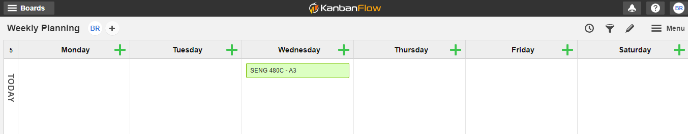

# Planning

Time management involves choosing when and how long to perform certain tasks. Since only one task can be completed at a time, people have to make judgement calls regarding which tasks get priority over others. Tasks with higher priority will likely be completed first and at the time(s) of day the person generally does their best work. Dimitrova and Mancheva-Ali stated in their paper "Planning and Time Management" that "Each of us has a number of tasks to work on (day, week, or month), and depending on how we rank them by importance, we will get the results from our work, which contributes to the success of the whole organization" [1]. Here they are talking about time management within an organization, but this can apply to time management for individuals as well.

## [KanbanFlow](https://kanbanflow.com/)

KanbanFlow is a project management tool that individuals and teams can use to plan out their different tasks and assign priorities. The benefit of this tool is that it is very customizable, so it does not constrain the user by forcing them to use it a certain way. The picture below shows a user that has customized the platform to reflect a typical week. 

Users can plan out their week by creating a new box for each task. When the boxes are created, they can be one of eight different colors. Users can choose to interpret these colors however they wish, but one potential way to would be to have each color correspond to a level of priority. They can assign the tasks to each day. If a task is not completed on a particular day, they can drag the task to another day. When it comes time to work on a task, the user can start the built-in timer which indicates how long they wish to work on the task without distraction. When the timer expires, the user can click the button indicating they want to take a break. The time they spent working on the task will be added to the cumulative total time spent on the task, allowing them to track their total time worked and see how much time was spent on each task.

## Augmenting Task Planning and Execution for Time Management

By planning their tasks in advance using a tool such as KanbanFlow, users are more likely to get a sense of how much work lies ahead of them. Also, by planning for a period of time (such as a week), it forces people to examine all of their upcoming tasks at once. During this time, they can assign each task a priority. They can then take the list of tasks and distribute them throughout the week based on priority and required completion date. 

KanbanFlow and similar tools can both support and complement the user with their time management planning and execution. The tool supports the user by providing them with a platform that allows them to plan out all of their tasks for the week in advance and also allows them to adjust their plan as time goes on by moving tasks around. The tool complements the user because of the inclusion of the timer within the application. By using the timer, the application will track the amount of time a user has put into a task. This complements the user because tracking the exact amount of work put into every task is something that many users would not likely do if they were using a less sophisticated time management system. By taking all of the tasks in their head and putting them into the platform, people can reduce their mental load. The time tracking system can help users get an idea of how much time different tasks took versus how much time they originally thought the task would take, allowing them to plan more effectively in the future.

## References

[1] V. Dimitrova and O. Mancheva-Ali, "Planning and Time Management," International Conference KBO, vol. 24, (1), pp. 283-288, 2018.
